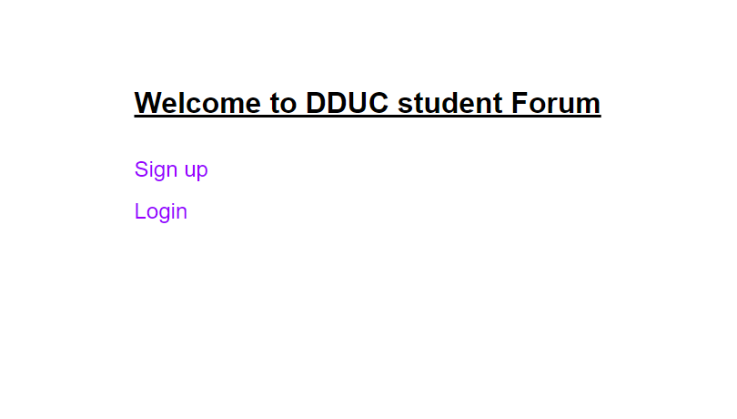
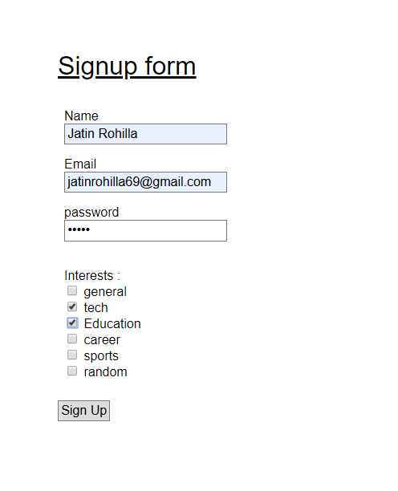
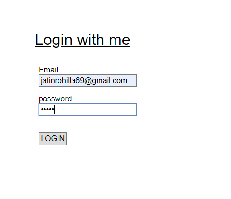
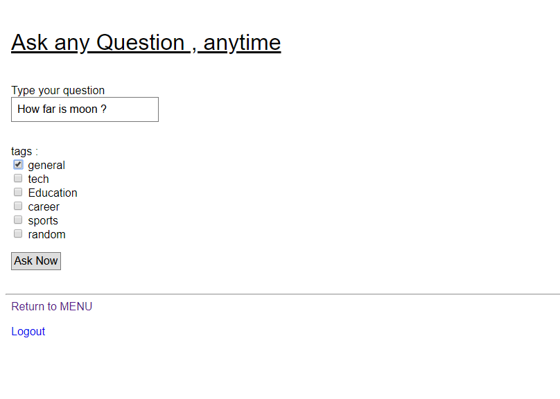
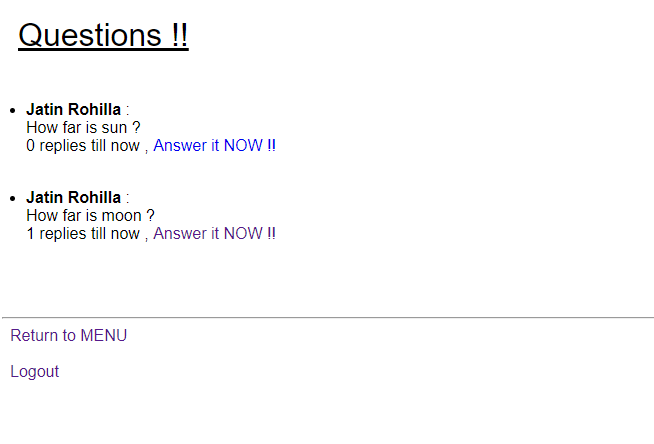
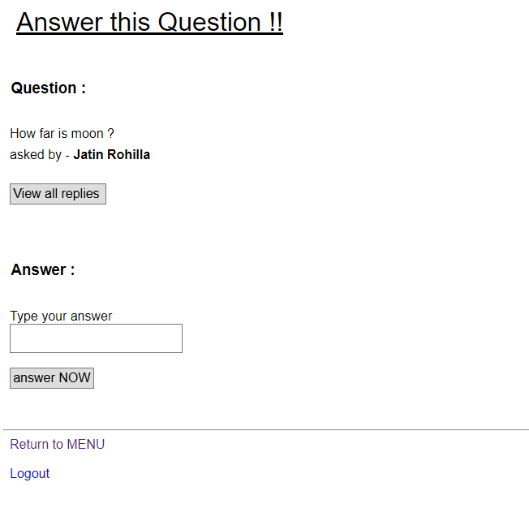
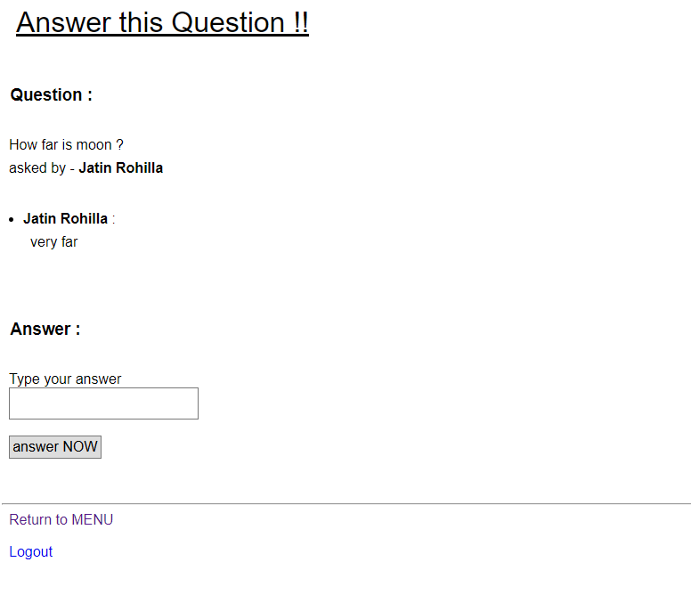

# Mini Quora

A minimal quora like application made with vanilla php, mysql, and basic javascript for validation.

## Setting up the project

- `Trivia` - This was made back in summer of 2015. This was my first php project.
- The setup is primitive. There are better ways to setup a php app these days.
- Setup servers
  - either install `XAMPP` / `LAMP`, it will take care of everything
  - or install `php7` and `mysql` on your system and make sure they're available on command line
  - If you're on windows, you'll need to set environment variables.
- Replace your mysql installation's username and password in `Qconnect.php`
- Now we need to start the `php` server.
  - If you're using `xampp`, simply open the control panel and fire up the apache server.
  - Alternatively, if you have `php7` installed in your computer, `php7` supports an inbuilt server. Simply navigate to the `src` folder and run the command `php -S localhost:8000` to fire up the server. Navigate to `http://localhost:8000` to see homepage.
- Now we need to start the `sql` server
  - If you're using `xampp`, simply open the control panel and fire up the mysql server
  - Alternatively, if you have `mysql` installed, simply start the server
- Next we need to create the database
  - Simply go to `http://localhost:8000/Qdatabase.php` in the browser. You should see a success message.
  - If there's any error, first resolve it. Most errors are because of wrong username and password.
  - Database dump `Quora.sql` for any reference if needed.
- The project uses only minimal css, focus is on backend.

## Demo Flow

- sign up
- login
- ask a question
- at any time, you can display all questions, answer them, view already written answers

## Screenshots

